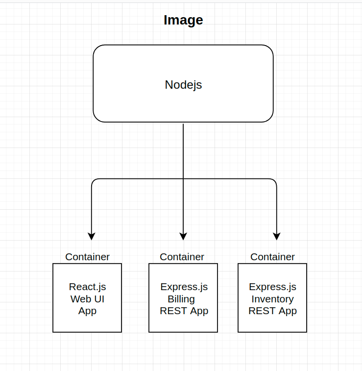
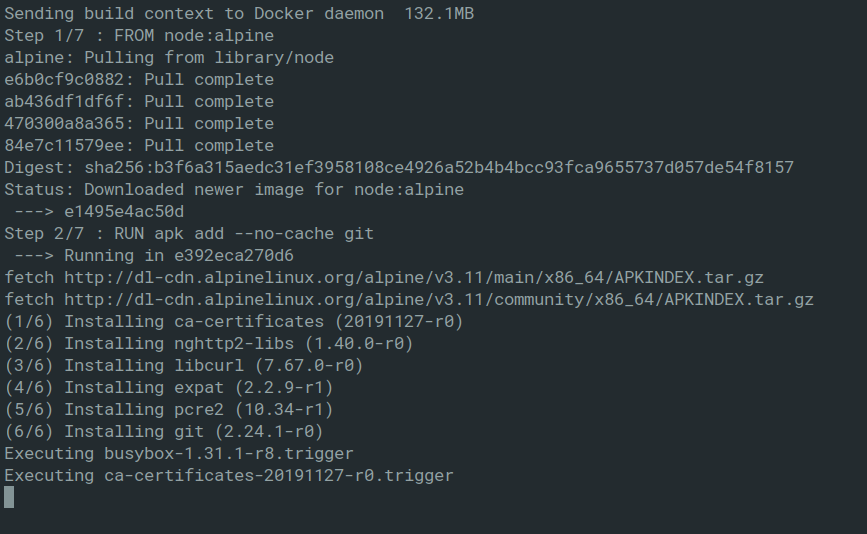
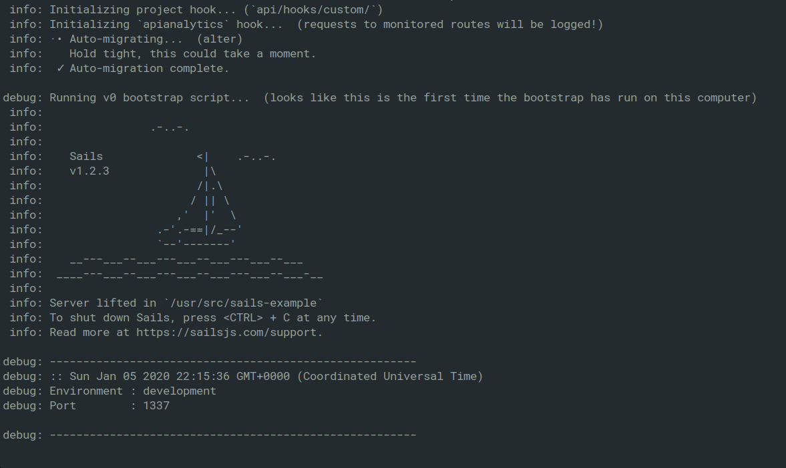
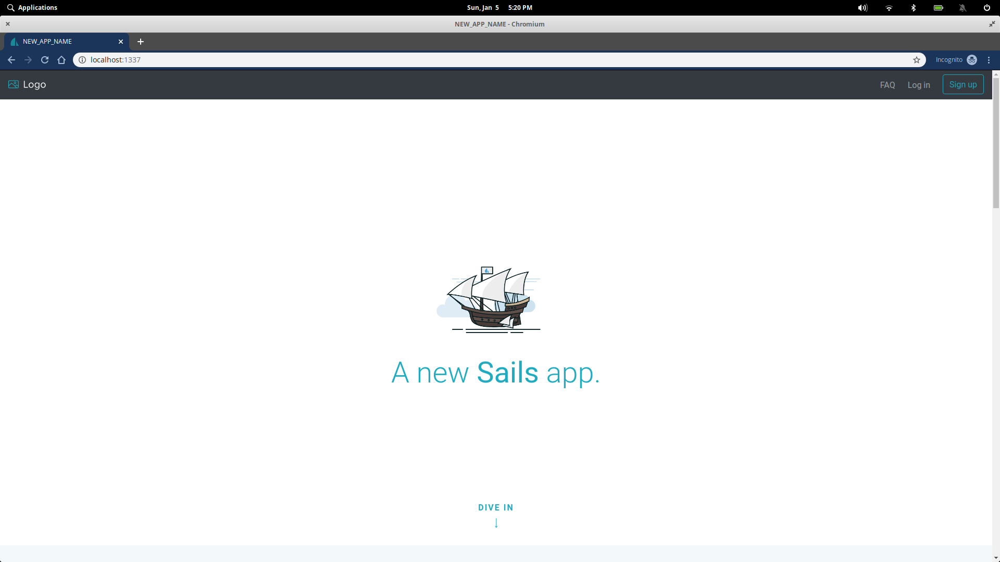

You've done it. You successfully built your backend!
This is the part where you tell yourself to forget about how you _built_ the damn thing and focus on the UI.

In reality, the mentality of taking anything for _granted_ with a build process is how we get _tears_. In this case it becomes easy to forget that your package manager is out of date, that you switched to Node 9.x via NVM that _one_ time, or that you're on a completely different machine now.

Some questions you might be asking yourself when working on a shared project:

- How do I avoid worrying about a reproducing a production build environment again when working on local?

- Can I **isolate** my build issues and resolve them before sharing code?

- How do I ensure that anyone else working with me is on the same environment when they pull/fork?

These might some of the doubts in your head but tools such as [Docker](<https://en.wikipedia.org/wiki/Docker_(software)>) can abstract most of that for you. Docker gives us a trustworthy and isolated build process so that you can test and share code with confidence.

By the end of this series we should be able to create a database, generate a schema, seed the DB, initialize our server, and run PGAdmin to connect it all through a single Docker command without worrying about what might happen when someone else has to work on it.

**Sounds pretty neat so what do I need to know?**

First thing that you're going to want to do is [install docker](https://docs.docker.com/install/). Your instructions might differ depending on which OS you're on. Once that's done, in your terminal type:

`docker version`

you should see something like this:


Docker itself is a broad topic to properly cover so for the sake of brevity and the scope of this series we'll be distilling things down to: [images](https://docs.docker.com/engine/reference/commandline/images/), [Dockerfiles](https://docs.docker.com/engine/reference/builder/) and [docker-compose](https://docs.docker.com/compose/).

For a higher level overview on Docker here's an excellent [article](https://towardsdatascience.com/learn-enough-docker-to-be-useful-b7ba70caeb4b) by [Jeff Hale](https://twitter.com/discdiver) that helps abstract a few notions about Docker.

## So whats an image anyway?

**In short an image is a file whose sole purpose is to carry dependencies and configurations for a program to run.**

The easiest way to understand what an image _is_, is by going ahead and
entering: `docker run hello-world` in your terminal.

If all goes well you should be given a feed of what might look like gibberish to you. However, they're some instructions on exactly how we're interacting with **images** within this prompt.

``` bash
 1. The Docker client contacted the Docker daemon.
 2. The Docker daemon pulled the "hello-world" image from the Docker Hub.
    (amd64)
 3. The Docker daemon created a new container from that image which runs the
    executable that produces the output you are currently reading.
 4. The Docker daemon streamed that output to the Docker client, which sent it
    to your terminal.
```


_Yep_... what's a daemon?

According to Wiki:

> A daemon is a type of program on Unix-like operating systems that runs unobtrusively in the background, rather than under the direct control of a user, waiting to be activated by the occurance of a specific event or condition.

Fascinating, great.

So somewhere between hitting the enter key and the prompt this Docker daemon was running around doing all the dirty work for us and when it finished it returns a `hello-world`.

If you run `docker ps -a` you should get something along the lines of
``` bash
| CONTAINER ID |    IMAGE    | COMMAND  |    CREATED     |          STATUS           | PORTS | NAMES   |
| ------------ | :---------: | :------: | :------------: | :-----------------------: | :---: | ------- |
| a0adf8a9dbe5 | hello-world | "/hello" | 23 minutes ago | Exited (0) 23 minutes ago |       | example |
```

**Now** we know we have this `hello-world` image, within our computer and we pulled it from this [_DockerHub_](https://hub.docker.com/) place which kinda sounds like GitHub but for images. The sole purpose of this image is to print _"Hello from Docker"_. There are images out there for just about everything node, postgres, ubuntu, if it's an environment then chances are there's an image for it.

You might've noticed that before our _"Hello from Docker"_ we received a message of:

``` bash
Unable to find image 'hello-world:latest' locally
latest: Pulling from library/hello-world
1b930d010525: Pull complete
```

Docker is smart enough to check for any existing images before pulling from the DockerHub which is pretty nifty.

So, now we know what an **image** is and how Docker goes about grabbing these _dependencies_ and _configurations_ for our programs to run. The next concept to really understand are [**Containers**](https://www.docker.com/resources/what-container). Without diving too deep into the relationship of containers and processes(heres an [article](https://medium.com/@jessgreb01/what-is-the-difference-between-a-process-a-container-and-a-vm-f36ba0f8a8f7) by [Jessica Grebenschikov](https://medium.com/@jessgreb01) that can shed some light), containers are essentially an instance of an image that runs our code.

Here's a fun little diagram to show how containers might go about in our application:



Great, now we know the relationship but how are we supposed to go about **building** these containers? When it comes to building containers Docker gives us a powerful tool to help us called [**Dockerfiles**](https://docs.docker.com/engine/reference/builder/).

## Dockerfiles are just a set of instructions

Straight from the Docs:

> A Dockerfile is a text document that contains all the commands a user could call on the command line to assemble an image. Using docker build users can create an automated build that executes several command-line instructions in succession.


Lets start by writing our own set of instructions for a [Sails](https://sailsjs.com/) API container. In your terminal:


``` bash
mkdir docker-example
cd docker-example
touch Dockerfile
```
Inside of our Dockerfile, lets tell Docker what it needs to know in order to successfully build a Sails App:

``` Docker
FROM node:alpine

RUN apk add --no-cache git

RUN mkdir usr/src/

RUN cd /usr/src && git clone https://github.com/nelson-lopez/sails-example 

WORKDIR /usr/src/sails-example

RUN npm install

CMD [ "node","app.js" ]

```

Now we can go ahead and run our build:

`docker build -t sails .`

All we're saying here is: docker, build a new container with the tag(**-t**) **_sails_** in the context of this **_directory_** (**.**).

Now Docker is going to check our current directory and see that there's an existing **Dockerfile** and run that build and call it **sails**.

Things are happening.



Let's see what's happening with our build step by step:

1. `FROM node:alpine`
Here we're telling Docker to pull a slim node **image** for our program to run on. Note that `FROM` gives Docker the _image_ context.
2. `RUN apk add --no-cache git`
**_node:alpine_** doesn't come with _git_ installed so Docker now see's this command and installs **git** for us. 

Note: Building from a github repo can be unconventional but for this example I wanted to show how versatile Docker can be.

3. `RUN mkdir usr/src/` Nothing too fancy here, we're just making a folder for our source code.

4. `RUN cd /usr/src && git clone https://github.com/nelson-lopez/sails-example` Now that we have an environment with **node** and **git** we can go ahead and pull a repo down. But first we have to move into the source directory.

5. `WORKDIR /usr/src/sails-example` Our src directory now has a _sails-example_ folder from the repo we pulled. To set the context of our container to that folder we now have to give it a `WORKDIR`. In this case its '/usr/src/sails-example'.

6. `RUN npm install` We install our Sails dependencies.

7. ``` Docker
CMD [ "node","app.js" ] 
```
Finally we assign `node app.js` as a command to execute when we run the container.

Perfect, now all we have to do is run the damn thing. We'll start by using the `run` command and then the `-p` flag to map a port to our container. In our terminal lets run `docker run -p 3001:1337` to map port **3001** to our container, if everything goes according to plan we should see the following:



If we go to `localhost:3001` in our browser we can see that Sails is running.



Now you have a Sails App up and running on your local with two commands and less than 15 lines of code with no CLI! This is really just scratching the surface on what you can do with Docker. Having one container is nice but Docker truly shines when you **compose** multiple containers together to make a multi-faceted app.

On the next part of this series we'll be covering **docker-compose** for weaving everything together. 
