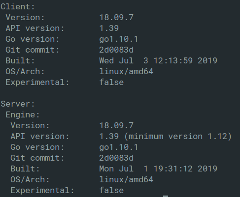

You've done it. You successfully built your backend!
This is the part where you tell yourself to forget about how you _built_ the damn thing and focus on the UI.

In reality, the mentality of taking anything for _granted_ with a build process is a promise waiting to be broken. In the case of going down the [happy path](https://en.wikipedia.org/wiki/Happy_path) it becomes easy to forget that your package manager is out of date, that you switched to Node 9.x via NVM that _one_ time, or that you're on a completely different machine now.

Some questions you might be asking yourself when going back to an old project.

- How do I avoid worrying about a reproducing a production build environment again when working on local?

- Can I **isolate** my build issues and resolve them before sharing code?

- How do I ensure that anyone working with me is on the same environment when they pull/fork?

These might be doubts in your head before you take that next step forward before pushing your code but tools such as [Docker](<https://en.wikipedia.org/wiki/Docker_(software)>) can abstract most of that for you.

By the end of this we should be able to create a database, generate a schema, seed the DB, initialize our server, and run PGAdmin to connect it all through a single Docker command.

**Sounds pretty neat so what do I need to know?**

First thing that you're going to want to do is [install docker](https://docs.docker.com/install/). Your instructions might differ depending on which OS you're on. Once that's done, in your terminal type:

`docker version`

you should see something like this:



Docker itself is a broad topic to properly cover so for the sake of brevity and the scope of this post we'll be distilling things down to: [images](https://docs.docker.com/engine/reference/commandline/images/), [Dockerfiles](https://docs.docker.com/engine/reference/builder/) and [docker-compose](https://docs.docker.com/compose/).

For a higher level overview on Docker here's an excellent [article](https://towardsdatascience.com/learn-enough-docker-to-be-useful-b7ba70caeb4b) by [Jeff Hale](https://twitter.com/discdiver) that helps abstract a few notions about Docker.

## So whats an image anyway?

**In short an image is a file whose sole purpose is to carry dependencies and configurations for a program to run.**

The easiest way to understand what an image is, is by going ahead and _run_
Enter: `docker run hello-world` in your terminal.

If all goes well you should be given a feed of what might look like gibberish to you. However, they're some instructions on exactly how we're interacting with **images** within this prompt.

```
 1. The Docker client contacted the Docker daemon.
 2. The Docker daemon pulled the "hello-world" image from the Docker Hub.
    (amd64)
 3. The Docker daemon created a new container from that image which runs the
    executable that produces the output you are currently reading.
 4. The Docker daemon streamed that output to the Docker client, which sent it
    to your terminal.
```


_I know_... what in the world is a daemon?

According to Wiki:

> A daemon is a type of program on Unix-like operating systems that runs unobtrusively in the background, rather than under the direct control of a user, waiting to be activated by the occurance of a specific event or condition.

Fascinating, great.

So somewhere between hitting the enter key and the prompt this Docker daemon was running around doing all the dirty work for us and when it finished it returns a `hello-world`.

If you run `docker ps -a` you should get something along the lines of

| CONTAINER ID |    IMAGE    | COMMAND  |    CREATED     |          STATUS           | PORTS | NAMES   |
| ------------ | :---------: | :------: | :------------: | :-----------------------: | :---: | ------- |
| a0adf8a9dbe5 | hello-world | "/hello" | 23 minutes ago | Exited (0) 23 minutes ago |       | example |

**Now** we know we have this `hello-world` image, inside a container, within our computer and we pulled it from this [_Docker Hub_](https://hub.docker.com/) place which kinda sounds like GitHub but for images. The sole purpose of this image is to print _"Hello from Docker"_.

You might've noticed that before our _"Hello from Docker"_ we received a message of:

```
Unable to find image 'hello-world:latest' locally
latest: Pulling from library/hello-world
1b930d010525: Pull complete
```

Docker is smart enough to check for any existing images before checking the Hub which is pretty nifty.
